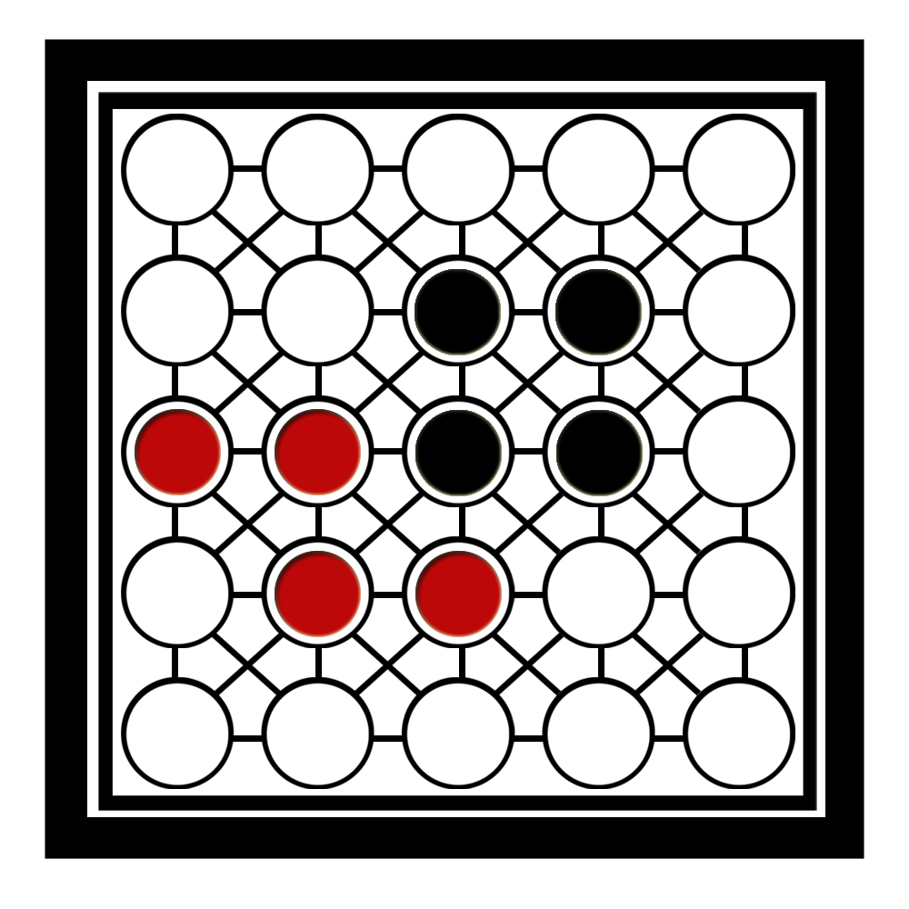

<a name="readme-top"></a>

[![Contributors][contributors-shield]][]
[![LinkedIn][linkedin-shield]][https://github.com/6abriel1chiro/teeko-intelligent-game/graphs/contributors]

<!-- PROJECT LOGO -->
<br />
<div align="center">
  <a href="https://github.com/6abriel1chiro/teeko-intelligent-game">
    
  </a>

<h3 align="center">teeko intelligent game</h3>

  <p align="center">
    project_description
    <br />
    <a href="https://github.com/6abriel1chiro/teeko-intelligent-game"><strong>Explore the docs »</strong></a>
    <br />
    <br />
    <a href="https://github.com/6abriel1chiro/teeko-intelligent-game/issues">Report Bug</a>
    ·
    <a href="https://github.com/6abriel1chiro/teeko-intelligent-game/issues">Request Feature</a>
  </p>
</div>

<!-- TABLE OF CONTENTS -->
<details>
  <summary>Table of Contents</summary>
  <ol>
    <li>
      <a href="#about-the-project">About The Project</a>
      <ul>
        <li><a href="#built-with">Built With</a></li>
      </ul>
    </li>
    <li>
      <a href="#getting-started">Getting Started</a>
      <ul>
        <li><a href="#installation">Installation guide</a></li>
      </ul>
    </li>
    <li><a href="#"></a></li>
  </ol>
</details>

<!-- ABOUT THE PROJECT -->

## About The Project

- The board starts with all the pieces positioned as shown in figure 1.
  • Black always start playing.
  •Each tile can be moved in 8 directions horizontally, vertically or diagonally (N,S,E,W, NE, NO,
  SE,SO) when possible and there is no obstruction. Always move the maximum number of places
  free that you have in that direction.
  • The player who arranges his four chips horizontally, vertically, forming a square or
  positioning their chips in the four corners

- In order for the program to make an "intelligent" decision of where to put its token next it must
  do the following:
  •Define a heuristic that determines the utility value of a state. Explain what is the logic behind
  of your heuristic.
  • Define a maximum height to expand the game tree that will decide how far said game tree should be explored.
  tree. Experiment with different heights and select the one whose average response time is
  < 10s.
  •Implement the algorithm MinMax + α −βpruning and MinMaxWithDepth(cut −off)

<p align="right">(<a href="#readme-top">back to top</a>)</p>

### Built With

Python

<p align="right">(<a href="#readme-top">back to top</a>)</p>
Installation

1. Clone the repository

   ```sh
   git clone https://github.com/6abriel1chiro/teeko-intelligent-game
   ```

2. Install requirements
   ```py
   pip install -r requirements.txt
   ```

<p align="right">(<a href="#readme-top">back to top</a>)</p>

<!-- USAGE EXAMPLES -->

<!-- ROADMAP -->

## Roadmap

- PROBLEM SOLUTION
- EXPERIMENTS
- CONCLUSION

<p align="right">(<a href="#readme-top">back to top</a>)</p>
<!-- CONTACT -->

## Contact

Name - [@6abriel1chiro](https://twitter.com/6abriel1chiro) - gabriel.balderrama@ucb.edu.bo

Project Link: [https://github.com/6abriel1chiro/teeko-intelligent-game](https://github.com/6abriel1chiro/teeko-intelligent-game)

<p align="right">(<a href="#readme-top">back to top</a>)</p>
